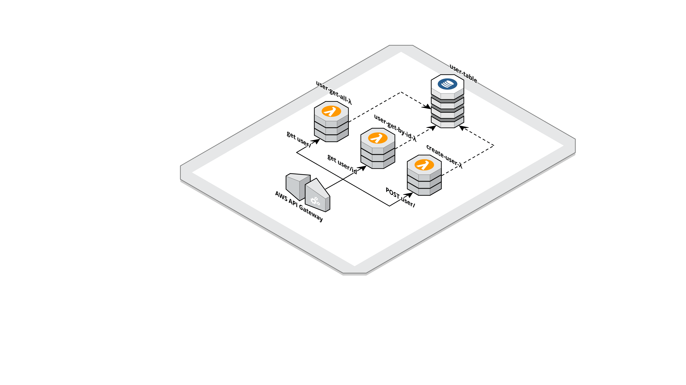

# aws-sam-typescript-dynamodb-ioc




This project contains source code and supporting files for a DDD typescript serverless application which ioc (injection with decorator)   that you can deploy with the SAM CLI. 

It includes the following files and folders :

- application - this layer is the entry point of the microservice 
- domain - This layer is the main layer wich contains the domain and its services
- infrastructure - This layer contains all interactions with Dynamodb using class and sdk AWS
- .sam-template.yaml - A template that defines the application's AWS resources.

Example of a service : 

```typescript
@service(UserService)
export class UserService {
    constructor(@inject('userRepository') private userRepository: UserRepository) {}

    /**
     * Save User
     * @param user
     */
    async saveUser(user: User): Promise<User> {

        return await this.userRepository.saveUser(user);

    }
```
The application uses several AWS resources, including Lambda functions and an API Gateway API. These resources are defined in the `.sam-template.yaml` file in this project. You can update the template to add AWS resources through the same deployment process that updates your application code.

If you prefer to use an integrated development environment (IDE) to build and test your application, you can use the AWS Toolkit.  
The AWS Toolkit is an open source plug-in for popular IDEs that uses the SAM CLI to build and deploy serverless applications on AWS. The AWS Toolkit also adds a simplified step-through debugging experience for Lambda function code. See the following links to get started.

* [PyCharm](https://docs.aws.amazon.com/toolkit-for-jetbrains/latest/userguide/welcome.html)
* [IntelliJ](https://docs.aws.amazon.com/toolkit-for-jetbrains/latest/userguide/welcome.html)
* [VS Code](https://docs.aws.amazon.com/toolkit-for-vscode/latest/userguide/welcome.html)
* [Visual Studio](https://docs.aws.amazon.com/toolkit-for-visual-studio/latest/user-guide/welcome.html)

## Run the application

To use the SAM CLI, you need the following tools.

* AWS CLI - [Install the AWS CLI](https://docs.aws.amazon.com/cli/latest/userguide/cli-chap-install.html) and [configure it with your AWS credentials].
* SAM CLI - [Install the SAM CLI](https://docs.aws.amazon.com/serverless-application-model/latest/developerguide/serverless-sam-cli-install.html)
* Node.js - [Install Node.js 10](https://nodejs.org/en/), including the NPM package management tool.
* Docker - [Install Docker community edition](https://hub.docker.com/search/?type=edition&offering=community)


Then Install dependencies 

```bash
aws-sam-typescript-dynamodb-ioc$ npm install
```

Specify your profile to point your AWS account and run the following command

```bash
aws-sam-typescript-dynamodb-ioc$ npm start
```

This will run the  SAM emulator based on docker. Access to the application on port 3000, unfortunately there is no Swagger now, but you can add users and acces it based on the path on the event

```bash
aws-sam-typescript-dynamodb-ioc$ curl http://localhost:3000/user
aws-sam-typescript-dynamodb-ioc$ curl http://localhost:3000/user/id
```

The SAM CLI reads the application template to determine the API's routes and the functions that they invoke. The `Events` property on each function's definition includes the route and method for each path.

```yaml
      Events:
        GetUserById:
          Type: Api
          Properties:
            RestApiId: !Ref ApiGateway
            Path: /user/{id}
            Method: GET
```


## Deploy the application

The Serverless Application Model Command Line Interface (SAM CLI) is an extension of the AWS CLI that adds functionality for building and testing Lambda applications. It uses Docker to run your functions in an Amazon Linux environment that matches Lambda. It can also emulate your application's build environment and API.


The SAM CLI uses an Amazon S3 bucket to store your application's deployment artifacts. If you don't have a bucket suitable for this purpose, create one. you can create new bucket with the name artiact-bucket based on this application

```bash
sam-typescript-dynamodb-ioc$ aws s3 mb s3://artifact-bucket 
```

To prepare the application for deployment, use the `npm run package` command.

```bash
sam-typescript-dynamodb-ioc$ npm run package
```

The SAM CLI creates deployment packages, uploads them to the S3 bucket, and creates a new version of the template that refers to the artifacts in the bucket.

To deploy the application, use the `npm run deploy` command.

```bash
sam-typescript-dynamodb-ioc$ npm run deploy
```
Then you can acces to your AWS account to check the API Gateway, lambdas and the Dynamodb DB table.


## Add a resource to your application
The application template uses AWS Serverless Application Model (AWS SAM) to define application resources. AWS SAM is an extension of AWS CloudFormation with a simpler syntax for configuring common serverless application resources such as functions, triggers, and APIs. For resources not included in [the SAM specification](https://github.com/awslabs/serverless-application-model/blob/master/versions/2016-10-31.md), you can use standard [AWS CloudFormation](https://docs.aws.amazon.com/AWSCloudFormation/latest/UserGuide/aws-template-resource-type-ref.html) resource types.

## Cleanup
Access to your account in CloudFormation 

```bash
aws-sam-typescript-dynamodb-ioc$ aws cloudformation delete-stack --stack-name sam-typescript-dynamodb-ioc
```


```bash
aws-sam-typescript-dynamodb-ioc$ aws s3 rb  s3://artifact-bucket 
```

## Maintainers  :
Big Thanks to our maintainers 💪💪💪  : 

- Elhadj NDIAYE
- Brendan Daoud https://github.com/granipouss
- Hatim HEFFOUDHI  https://github.com/hatim-heffoudhi
